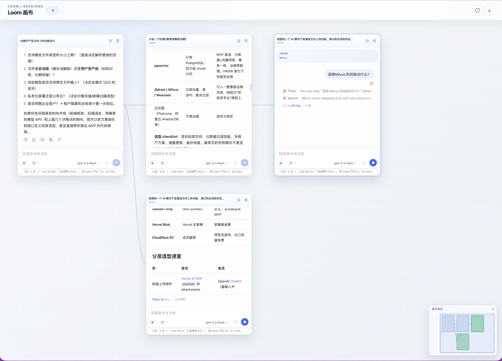

# dsh-plugin-loom-chat

Loom Chat is a DSH Web client plugin that turns linear ordinary sessions into a pannable, zoomable Loom-style canvas for parallel exploration.

[](https://www.npmjs.com/package/dsh-loom-chat)
[](https://github.com/onenameneo/dsh-plugin-loom-chat/actions/workflows/ci.yml)
[](LICENSE)

[中文说明](README.zh.md) · [GitHub repository](https://github.com/onenameneo/dsh-plugin-loom-chat)

## Loom project

[Loom](https://github.com/onenameneo/Loom) is a local Agent workbench that turns AI conversations into an explorable space for thinking. It combines streamed conversations with a branching canvas, project-based files and sessions, deliberate context management, Agent tools, MCP servers, long-term memory, and local Agent activity tracking. A question can be split into multiple lines of investigation, arranged as a thought graph, and continued with the right context on each branch. Loom is designed for research, learning, writing, coding, and other work that benefits from sustained thinking and parallel exploration. This plugin brings Loom's branching-canvas experience to DSH Web as a lightweight companion.

## Install

Loom Chat is available as an npm package with prebuilt browser code. Install it without a tag to receive the current `latest` release:

### Latest release

```sh
dsh plugin --profile web add dsh-loom-chat
dsh web
```

### Install from GitHub

Use the repository source when you need the latest unreleased commit:

```sh
dsh plugin --profile web add github:onenameneo/dsh-plugin-loom-chat
dsh web
```

GitHub installs build the package locally through its `prepare` script. If pnpm asks for permission to run the build, add the exact package name it reports to the profile's `pnpm-workspace.yaml` under `allowBuilds`, then run the install command again. Prefer the npm installation for normal use because it downloads prebuilt artifacts.

To update or remove the plugin:

```sh
dsh plugin --profile web update dsh-loom-chat
dsh plugin --profile web remove dsh-loom-chat
```

The plugin contributes to the `web` profile only; it does not modify the DSH native sidebar or replace the native conversation renderer.

## What it does

It is designed for exploring several directions around one question: keep the main session as the context origin, fork new questions into independent sessions, and inspect the resulting paths together on the canvas.

- Every Canvas window can read its transcript, edit its draft, send a message, and stop generation independently.
- Canvas transcript rendering is owned by this plugin: it displays text/Markdown, code, reasoning, tool and status summaries, commands, context, attachment references, and readable fallbacks for unknown content shapes.
- A message or text selection can start a branch. The child inherits the DSH context before the fork boundary, while selected text remains as a reference card at the top of the child session.
- Child sessions are independent and can branch to unlimited depth. The plugin does not copy rendered messages or synchronize later messages automatically.
- Use native single-session mode when you need the full host composer, including attachments, slash commands, model selection, or Plan controls.

## Usage demo

Open Loom from the native DSH session header to pan and zoom across the canvas. Use the branch action on any session window to continue exploring from that context. Every branch keeps its own history, draft, and runtime state, so several lines of thought can move forward in parallel.


_Opening the Loom canvas from a native session._



_Viewing related but independent conversations together on one canvas._

## Why “Loom”

“Loom” is a weaving machine. A conversation can be thought of as a thread of reasoning: it starts from a main session, branches into different directions, and unfolds in parallel on the same canvas. Loom Chat is named for the way it weaves those separate lines of exploration into a visible, extensible conversation network instead of flattening them into a single linear record.

## Interaction model

- **Canvas mode**: the main area shows the complete ordinary-session parent/child lineage as live session windows, with pan, zoom, node selection, and branching from any window.
- **Interactive windows**: every visible session keeps its own projected transcript, draft, send action, stop action, and running/error state. Multiple sessions can run side by side without opening one over another. Deleting a window requires confirmation and archives its descendants together.
- **Single-session mode**: opening a node returns to DSH's native conversation surface, including the native composer, tools, attachments, Plan, model selection, and projections.
- **Mode switching**: clicking a window only selects it; the window's Chat action enters native focus mode. The native session header exposes a Loom entry action; returning to Canvas restores the selected node and the in-memory viewport for the current page.
- **Unlimited depth**: Canvas recursively derives lineage from each session's `parentId` without a branch-depth limit.

## Context inheritance

Topic branching uses DSH `sessions.fork({ sessionId, atSeq, increaseTitle })`. A child inherits the durable session history through the fork boundary and is independent from its parent and siblings afterward. For a text-selection branch, the first submitted prompt also carries the selected excerpt in a structured reference block, so the model receives both the inherited history and the exact selected text. The plugin never copies rendered messages or synchronizes future messages automatically.

The fork boundary must be a stable completed-turn boundary. Running sessions are not clipped. Selection-branch presentation state is restored by child session ID after a page reload, so the reference card remains visible while inherited messages before the boundary stay hidden. Sessions with `origin: 'subagent'` are excluded from the ordinary Loom topic graph.

The first non-empty continuation prompt in a Loom child becomes its normalized title, truncated to 30 Unicode characters with an ellipsis when needed. This works with both the fallback plugin composer and the host full Composer by observing the first user node after the fork boundary. It uses the public session rename operation, makes no auxiliary model request, and does not rename the child again for later prompts.

Canvas windows use the public DSH session and per-session input faces. They are intentionally a compact interaction surface for parallel work; use single-session mode for the host's full composer features such as attachments, slash commands, model selection, and Plan controls.

## DSH plugin assembly

The host entry exports Cordis `apply`; the browser entry declares the Web platform, injected dependencies, and `exports["./client"]` through `dsh.client`. `dsh.bundle.patch` points to a top-level array `cordis.patch.yml`, allowing a profile to load the plugin as an optional bundle.

The plugin consumes only public DSH session, runtime, conversation, workspace, and UI slot capabilities. New host capabilities should be exposed by DSH as public slots or services before a plugin consumes them; the plugin does not import private host components.

For the minimal Cordis plugin structure, see [Your first plugin](https://github.com/deepseek-ai/deepseek-harness/blob/master/docs/user/develop/basic/index.md). For browser bundle assembly, see [Client Modules](https://github.com/deepseek-ai/deepseek-harness/blob/master/docs/subsystems/client-modules.md).

## Host boundary

The plugin does not modify DSH's native sidebar, `ui-workspace`, or the main conversation renderer. Canvas uses the public session/runtime APIs and `shell.overlay`; when a detached window is cold, the plugin temporarily stages it through `ctx.sessions.open()` to hydrate public history, serializes those requests, and restores the user's previous current session. Canvas never calls private host renderers or a per-window `session.open()` method. Single-session mode returns control to the host with `ctx.sessions.open()`.

Canvas deliberately does not promise the host's full Composer inside every window. Attachments, slash commands, model selection, Plan controls, and other host-specific controls remain available after opening a window in native single-session mode.

## Privacy & permissions

Based on its current runtime code, Loom Chat:

- does not directly send data to third-party servers;
- does not read API keys or environment variables;
- does not execute shell commands;
- uses DSH's public session, runtime, conversation, workspace, and UI APIs;
- stores Loom branch presentation metadata, including derived titles and boundaries, in browser `localStorage`;
- can open, fork, rename, cancel, and archive DSH sessions when requested through the plugin UI.

## Compatibility

- DSH Web profile with the public session, runtime, conversation, workspace, and UI slot APIs.
- DSH package line `0.1.x`, tested against the aligned `0.1.0-rc.7` public package set; the peer dependency range is `<0.2.0`.
- The plugin follows the DSH developer-preview APIs; compatibility can change as DSH evolves.
- Local development and package builds require Node.js `^22.19.0` or `>=24.0.0` and pnpm `11.7.0`.

## Local development

```sh
pnpm install
pnpm test
pnpm typecheck
pnpm build
pnpm pack --pack-destination ./.artifacts
```

Test a packed plugin in a temporary profile:

```sh
DSH_HOME=/tmp/dsh-loom-chat-profile \
  dsh plugin --profile web add "$PWD/.artifacts/dsh-loom-chat-0.1.0-rc.3.tgz"
```

## Publishing

Maintainers publish releases to the `latest` channel:

```sh
npm login
npm whoami
pnpm test
pnpm typecheck
pnpm build
pnpm run pack:verify
pnpm publish --tag latest
```

The `prepare` script builds `lib/` before publishing, and `files` limits the published package to the runtime, type declarations, DSH patch, documentation, and license.
