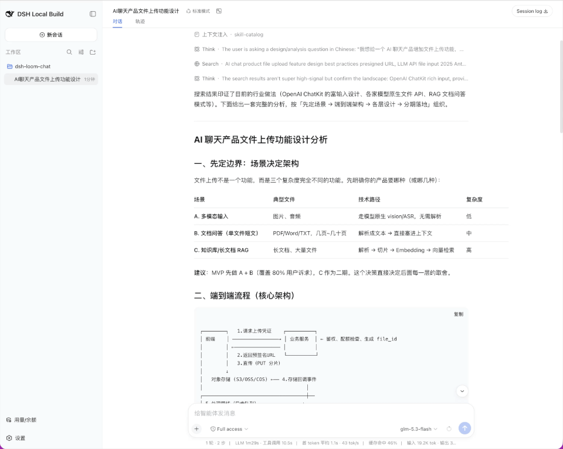

# dsh-plugin-loom-chat

Loom Chat 是一个 DSH Web 客户端插件，把线性的普通会话转换为可平移、缩放和并行操作的 Loom 风格无限画布。

[](https://www.npmjs.com/package/dsh-loom-chat)
[English README](README.md) · [GitHub 仓库](https://github.com/onenameneo/dsh-plugin-loom-chat)

## 安装

Loom Chat 已通过 npm 分发，npm 包包含预构建的浏览器代码。根据需要选择稳定版或预发布版：

### 稳定版

```sh
dsh plugin --profile web add dsh-loom-chat
dsh web
```

### 预发布版

`next` 标签用于候选版本和其他预发布版本：

```sh
dsh plugin --profile web add dsh-loom-chat@next
dsh web
```

### 从 GitHub 安装

需要最新的、尚未发布的提交时，可以直接安装仓库源码：

```sh
dsh plugin --profile web add github:onenameneo/dsh-plugin-loom-chat
dsh web
```

从 GitHub 安装时会通过 `prepare` 脚本在本地构建。如果 pnpm 要求确认构建权限，请将它提示的准确包名添加到 profile 的 `pnpm-workspace.yaml` 中的 `allowBuilds`，然后重新执行安装命令。日常使用建议从 npm 安装，因为 npm 包直接提供预构建产物。

更新或卸载插件：

```sh
dsh plugin --profile web update dsh-loom-chat
dsh plugin --profile web remove dsh-loom-chat
```

插件只装配到 `web` profile，不会修改 DSH 原生侧边栏，也不会替换原生会话渲染器。

## 功能介绍

它适合需要围绕一个问题同时探索多个方向的场景：保留主会话作为上下文起点，把新的问题分支到独立会话中，并在画布上同时查看各条探索路径。

- 画布中的每个会话窗口都可以直接阅读历史、编辑输入、发送消息和停止生成。
- Canvas 的 transcript 和消息渲染完全由本插件实现，支持文本/Markdown、代码、思考、工具和状态摘要、命令、上下文、附件引用；遇到未知的数据结构时也会显示可读的 fallback。
- 从消息或选中文字发起分支时，子会话继承 DSH 分岔边界前的上下文；选中文字会以引用内容保留在子会话顶部。
- 子会话之间互相独立，支持继续创建更深层级的分支，不复制渲染后的消息，也不自动同步后续内容。
- 需要完整附件、斜杠命令、模型选择或 Plan 能力时，可以从窗口进入 DSH 原生单会话模式。

## 使用演示

从 DSH 原生会话头部进入 Loom 后，可以在画布中平移和缩放视图；点击任意会话窗口的分支按钮，就能从对应的上下文继续探索新的方向。每条分支都有独立的历史、输入和运行状态，可以同时推进多个思路。



_从原生会话打开 Loom 画布。_


_在同一张画布上查看多个相互关联、又彼此独立的会话。_

## 为什么叫 Loom

Loom 的英文原意是“织布机”。一次对话像一根思路线：从主会话出发，随着问题分支成不同方向，再在同一张画布上并行展开。Loom Chat 希望像织布机一样，把这些分散的思路编织成一张可观察、可继续延展的对话网络，而不是把探索过程压缩成一条线性的记录。

## 交互模型

- **Canvas 模式**：主区域把普通会话的完整父子关系展示成多个可交互的会话窗口，支持平移、缩放、窗口选择和从任意窗口继续岔出。
- **窗口交互**：每个窗口都有自己的会话历史、草稿、发送、停止、运行中和错误状态；多个会话可以同时在画布中并行运行，互不覆盖，也不会共享输入内容。删除窗口需要确认，并会一并归档它的所有子节点。
- **单会话模式**：打开某个节点后进入 DSH 原生会话界面，继续使用原生输入框、工具、附件、Plan、模型选择和会话投影。
- **模式切换**：点击窗口只会选中它；只有点击窗口右上角的“聊天”按钮才进入原生单会话模式。单会话头部提供 Loom 入口；回到 Canvas 时恢复当前选中节点和本次页面运行中的视口。
- **无限层级**：Canvas 根据每个会话的 `parentId` 递归构建关系，不限制分支深度。

## 上下文继承

岔出话题使用 DSH 的 `sessions.fork({ sessionId, atSeq, increaseTitle })`。子会话继承分岔边界之前的持久化会话历史，随后与父会话、兄弟会话独立。对于选中文字的分岔，首次发送的 prompt 还会以结构化引用块携带选中片段，使模型同时收到继承的历史和准确的选中文本。插件不会复制渲染后的消息，也不会自动同步后续消息。

分岔位置必须是已完成轮次的稳定边界。正在运行的会话不会被截断分叉。选中文字分岔的展示状态按子会话 ID 恢复，页面重载后引用卡仍然保留，分岔边界之前的继承消息继续隐藏。带有 `origin: 'subagent'` 的会话不作为 Loom 普通话题节点展示。

Loom 子会话第一次发送非空的继续提问后，会使用归一化后的提问生成标题，最多保留 30 个 Unicode 字符，超出时追加省略号。无论消息来自插件回退输入框还是宿主完整 Composer，插件都会观察分岔边界后的第一条用户消息完成改名。这个过程调用宿主公开的会话改名操作，不额外请求大模型，后续提问也不会重复改名。

Canvas 窗口使用 DSH 公开的 session face 和每会话 input face。它是用于并行探索的紧凑交互面；需要附件、斜杠命令、模型选择、Plan 等完整输入能力时，进入单会话模式使用宿主原生界面。

## DSH 插件装配

插件宿主入口导出 Cordis `apply`，浏览器入口通过 `dsh.client` 声明 Web 平台、依赖注入和 `exports["./client"]`。`dsh.bundle.patch` 指向顶层数组格式的 `cordis.patch.yml`，由 profile 将插件作为可选 bundle 装载。

插件只使用 DSH 的公开 session、runtime、conversation、workspace 和 UI slot 能力；需要开发新的宿主能力时，应先在 DSH 中提供公开 slot 或 service，再由插件消费。插件自身不依赖宿主私有组件。

开发入口和 Cordis 插件的最小结构可参考 [DSH 插件入门](https://github.com/deepseek-ai/deepseek-harness/blob/master/docs/user/develop/basic/index.zh.md)，Web 客户端 bundle 的装配规则见 [Client Modules](https://github.com/deepseek-ai/deepseek-harness/blob/master/docs/subsystems/client-modules.zh.md)。

## 宿主边界

插件不修改 DSH 原生侧边栏、`ui-workspace` 或主会话渲染器。Canvas 使用公开的 session/runtime 与 `shell.overlay` Slot；脱离当前选择且尚未加载历史的窗口，会由插件串行调用 `ctx.sessions.open()` 临时完成公开历史 hydration，然后恢复用户之前的当前会话。Canvas 不调用宿主私有 renderer，也不依赖窗口级 `session.open()`。单会话模式通过 `ctx.sessions.open()` 交回宿主会话界面。

Canvas 不承诺在每个窗口内复刻宿主的完整 Composer。附件、斜杠命令、模型选择、Plan 等宿主专属控件，请打开窗口进入原生单会话模式使用。

## 兼容性

- 需要使用 DSH Web profile，以及公开的 session、runtime、conversation、workspace 和 UI slot 能力。
- DSH 包版本线为 `0.1.x`，当前使用并验证的是一致的 `0.1.0-rc.7` 公开包集合；peer dependency 上限为 `<0.2.0`。
- 插件依赖 DSH 当前的开发预览 API；随着 DSH 演进，兼容性可能发生变化。
- 本地开发和构建需要 Node.js `^22.19.0` 或 `>=24.0.0`，以及 pnpm `11.7.0`。

## 本地开发

```sh
pnpm install
pnpm test
pnpm typecheck
pnpm build
pnpm pack --pack-destination ./.artifacts
```

使用临时 profile 验证打包插件：

```sh
DSH_HOME=/tmp/dsh-loom-chat-profile \
  dsh plugin --profile web add "$PWD/.artifacts/dsh-loom-chat-0.1.0-rc.3.tgz"
```

## 发布 npm

维护者可以将候选版本发布到 `next`，将稳定版本发布到 `latest`：

```sh
npm login
npm whoami
pnpm test
pnpm typecheck
pnpm build
pnpm pack --dry-run
pnpm publish --tag next       # 候选版本
# pnpm publish --tag latest   # 稳定版本
```

`prepare` 脚本会在发布前构建 `lib/`；`files` 字段会限制最终包只包含运行时代码、类型声明、DSH patch、文档和许可证。
